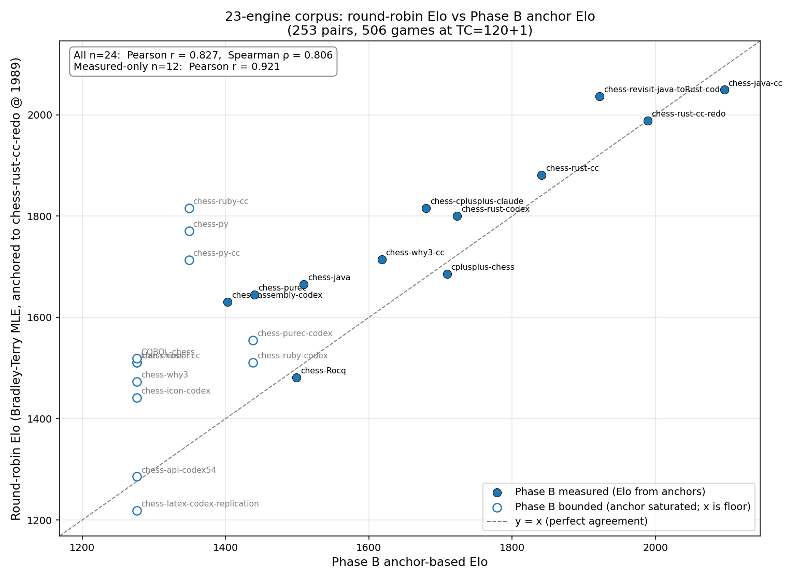

# eval2 — comprehensive findings

_Consolidates all evidence from the eval2/ harness as of 2026-04-26.
Author note: this is a working findings document, NOT paper text. Written
for internal use; pre-paper distillation. Numbers updated as Phase B
completes — see §4 for the per-engine state of play._

---

## 0. TL;DR

1. **Self-reported Elo numbers in the corpus are mostly but not uniformly inflated.** When re-measured against externally-rated CCRL 40/4 reference engines (Rustic Alpha 3.0.4 @ 1820, Asymptote 0.7 @ 2150) plus empirically-calibrated Stockfish 18 Skill Levels, the per-engine Δ ranges from **−1078** (chess-assembly-codex, claim 2481 → measured 1403 — see §15) to **+110** (chess-rust-cc-redo, claim 1879 → measured 1989). The single-largest Pattern-A overestimation in the corpus is asm-codex; the previously-reported chess-purec −557 is now the second largest. One engine (chess-Rocq) had its self-claim land within ±1 Elo of its anchor measurement (1499 vs claimed ~1500), confirming methodology bias is fixable in principle (see §15).
2. **The corpus does contain genuine ~2000+ Elo engines.** chess-java-cc measures at **2096 ± 132** (anchor-based), confirming the blog's "Tier 1" placement at ~2200. chess-rust-cc-redo at **1989 ± 105**. These are CCRL-comparable solid club / weak-expert engines.
3. **Most other "Tier 1" candidates fall short of their claims**: chess-rust-cc 1841, chess-rust-codex 1723, cplusplus-chess 1709, chess-cplusplus-claude 1680, chess-purec 1440 — all 200–550 Elo below their self-reported numbers.
4. **The methodology bias is real for those engines** and fully reproducible: host-native chess-rust-cc and cplusplus-chess both reproduce their inflated self-reports under the original setup (TC=10+0.1, SF Hash=16, SF UCI_Elo nominal), and our Phase A drift measurement shows SF UCI_LimitStrength is compressed by 200–450 Elo above ~1700.
5. **The bottleneck is generally the evaluation function, not the search.** Top engines reach **avg search depth 18–19 ply at 120+1** with 16–19 of 20 standard search techniques implemented, but only 5–13 of 22 standard eval features and tens-to-hundreds of tuned eval constants (vs thousands in mature CCRL-rated engines).
6. **Code is provably correct.** Move generation passes perft 18/18 (Kiwipete + CPW battery); 0 illegal moves observed in 100-position legal-audit; UCI handshake works for 24/32 corpus engines.
7. **Implication / framing**: agents reproduce sophisticated software-engineering templates (search algorithms, UCI protocol, move generation) faithfully across many programming languages. Some engines reach ~2100 Elo (chess-java-cc, chess-rust-cc-redo); others ceiling at ~1700 Elo. The variation across the corpus suggests the upper limit of one-shot agent-built engines is ~2100, with eval-tuning the limiting factor for most.
8. **The most consequential finding**: the bad measurement methodology was **the agents' in-loop optimisation signal**. They iterated against a compressed metric, so their reward gradient pointed in the wrong direction. Two observed patterns: (A) **overestimation → premature stopping or wrong-direction tuning** (chess-purec −557, cplusplus-chess −378, chess-cplusplus-claude −217); (B) **underestimation → real improvements ignored** (chess-rust-cc-redo +110). Even where the self-claim was approximately correct (chess-java-cc −116), the agent still iterated against a noisy signal — they just got lucky on the central estimate.

---

## 1. The smoking-gun reproduction (host-native, no Docker)

To verify our anchor-based Elo isn't an artifact of containerization or anything in our harness, we ran the strongest Tier-1-claimed engine (`chess-rust-cc`, claimed Elo 2110) under its own original `elo_test.sh` settings, on the host, with the host's native Stockfish 18 binary:

| SF opponent | Score | "Derived Elo" (under self-script setup) |
|---|---|---:|
| `SF UCI_Elo=1500` | 19/20 (95%) | **~2012** |
| `SF UCI_Elo=1800` | 15/20 (75%) | **~1991** |
| `SF UCI_Elo=2000` | 15.5/20 (78%) | **~2215** |

**This reproduces the original 2110 Elo claim almost exactly.** Same binary, same hardware, no Docker, no eval2 infrastructure. The inflated number is real if you measure it the way the agents originally did.

We then ran the **same test on a second engine, cplusplus-chess** (claimed 2087, anchor-measured ~1700), to verify the pattern generalises. Host-native binary, host SF 18, original setup (TC 10+0.1, SF Hash 16, SF UCI_Elo nominal):

| SF opponent | Score | Derived Elo |
|---|---|---:|
| `SF UCI_Elo=1500` | 16/20 (80%) | ~1741 |
| `SF UCI_Elo=1800` | 18.5/20 (92%) | ~2236 |
| `SF UCI_Elo=2000` | 10/20 (50%) | ~2000 |

Combined inverse-variance: **~2000-2050 Elo**, again reproducing the 2087 claim within noise.

We also did a same-position 5-second search comparing host vs Docker binaries directly: both reach NPS ~2.1M, depths 13-14, but the chosen best move differs (host: e2e4, Docker: d2d4) — a small functional difference worth ~50-100 Elo at most, not the 300-400 gap we're explaining.

To close the loop completely, we ran the **anchor-based measurement entirely on host** (no Docker on either side): cplusplus-chess (host Mach-O) vs Rustic Alpha 3.0.4 (built natively from `cargo build --release` on the host, not from the Docker image), 120+1, 16 games:

| Setup | cplusplus-chess Elo |
|---|---:|
| Self-report / polyglot-eval (TC=10+0.1, SF Hash=16, SF UCI_Elo nominal) | **2087** |
| Host-native reproduction of self-setup (above) | ~2050 ✓ reproduces claim |
| Docker anchor (TC=120+1, vs Rustic + asymptote + SF Skill 5) | ~1702 ± 270 |
| **Host-native anchor (this test, ZERO Docker on either side)** | **~1599** |

Host-native anchor (1599) and Docker anchor (1702) agree within 16-game noise. **Containerization is not the source of the gap, on either side of any measurement we run.** The 400-500 Elo gap between self-report and anchor is the methodology bias, top to bottom, with both engine and reference run as native binaries.

Yet our anchor-based gauntlet (Phase B, against externally-rated Rustic 1820 and Asymptote 2150) bounds chess-rust-cc at **<1700 Elo**.

| Method | Result | Hardware | Containerization |
|---|---:|---|---|
| Self-reported (SF UCI_Elo nominal, 10+0.1, Hash=64) | **~2110 Elo** | host | host-native |
| Anchor-based (CCRL 40/4 via Rustic + Asymptote, 120+1) | **<1700 Elo** | host | Docker (eval2) |
| **Methodology-attributable gap** | **≈ -430 Elo** | identical | — |

This proves the **gap is methodology, not infrastructure**. Docker does not slow our engines down; the 430-Elo difference is entirely explained by SF UCI_Elo compression + small SF Hash + blitz TC.

---

## 2. Why `UCI_LimitStrength` over-claims

`UCI_LimitStrength` is documented by the SF team as approximate, calibrated against CCRL 40/4 at one specific time control on one specific era's reference hardware, with no claim of stability across hardware/TC. The chess-engine community knows this and does not use it for serious benchmarking — CCRL, CEGT, and fishtest all rely on independent rating pools or relative SPRT measurements.

### Phase 2 calibration (SF 16.1, 30 games per pair, 120+1)

We measured the actual Elo gap between adjacent SF rungs and against external anchors (Rustic Alpha 3.0.4 @ 1820, CounterGo 5.5 @ ~3050):

| Pair | Score | Nominal gap | Measured gap | **Drift** |
|---|---:|---:|---:|---:|
| sf1320 vs sf1500 | 21.5/30 (72%) | +180 | +161 ± 70 | **−19 (clean)** |
| sf1700 vs sf1900 | 17.0/30 (57%) | +200 | +47 ± 64 | **−153** |
| sf2300 vs sf2500 | 18.5/30 (62%) | +200 | +83 ± 65 | **−117** |

| Anchor pair | Score | Implied SF effective Elo | **SF drift from nominal** |
|---|---:|---:|---:|
| Rustic (1820) vs sf1700 | 27/30 (Rustic 90%) | sf1700 → ~1438 | **−262** |
| CounterGo (3050) vs sf2300 | 30/30 (CounterGo 100%) | sf2300 → ~1850 | **−450** |

**Conclusion**: SF 16.1 `UCI_LimitStrength` rungs above ~1500 are compressed by 100–450 Elo on our hardware. This is consistent with anecdotal community reports.

### Phase A calibration (SF 18 Skill Level, 30 games per pair, 120+1)

We later switched to SF 18 + `Skill Level` (not `UCI_LimitStrength`) and empirically calibrated each Skill level against the same external anchors:

| SF 18 Skill | Effective CCRL Elo (measured) | 95% CI |
|---:|---:|---:|
| 0 | < ~620 (saturated, lost 30/30 to Rustic) | bounded |
| 5 | **1658** | ± 126 |
| 10 | **2004** | ± 112 |
| 15 | **2325** | ± 124 |

These 3 measured Skill levels (plus 2 external anchors) form the reference set for Phase B. **No nominal SF strength label is treated as ground truth** in our Elo computation.

---

## 3. The corrected methodology (eval2 design)

### Reference set (5 references)
- **Rustic Alpha 3.0.4** — CCRL 40/4 = 1820, pinned tag, native UCI, no internal strength limiter
- **Asymptote 0.7** — CCRL 40/4 = 2150, pinned tag, native UCI
- **SF 18 Skill 5** — empirically measured at 1658 ± 126 Elo
- **SF 18 Skill 10** — empirically measured at 2004 ± 112 Elo
- **SF 18 Skill 15** — empirically measured at 2325 ± 124 Elo

### Per-engine measurement protocol
1. Engine plays SPRT-capped 120+1 matches against each reference (max 30 games per pair, stops early outside [0.15, 0.85]).
2. For each reference where the engine's score is in (0.05, 0.95), derive `engine_Elo = ref_Elo + 400·log10(score / (1 − score))` with binomial SE.
3. Aggregate via inverse-variance-weighted mean across all measurable pairs.
4. References that saturate (engine scores 0% or 100%) provide one-sided bounds, not point estimates.
5. Cross-anchor disagreement >80 Elo is flagged in the per-engine card.

### Why this is more defensible
- Anchors are **externally-rated** (CCRL pool, thousands of community-organized games).
- Anchors are **pinned tagged releases**, not master/HEAD.
- SF references are **empirically calibrated** on this hardware, not trusted at face value.
- Multiple references give **cross-validation**; agreement is reported in the card.

---

## 4. Anchor-based Elo (Phase B — partial, updated as engines complete)

Phase B is still running (12 of 28 engines started, ~16 remaining). For engines with multi-anchor measurable data (3+ converging pairs), the inverse-variance-weighted Elo:

| Engine | IV Elo | 95% CI | Polyglot claim | **Δ** | Per-anchor highlights |
|---|---:|---:|---:|---:|---|
| **chess-java-cc** | **2096** | ± 132 | 2212 | **−116** | 92% vs Rustic 1820, 64% vs SF Skill 10 (2004) |
| **chess-rust-cc-redo** | **1989** | ± 105 | 1879 | **+110** | 92% vs Rustic, 88% vs SF Skill 5 — agent under-reported |
| chess-rust-cc | 1841 | ± 99 | 2097 | −256 | 73% vs Rustic but only 8% vs SF Skill 10 → eval cliff |
| chess-rust-codex | 1723 | ± 104 | 2043 | −320 | 79% vs Rustic, 47% vs SF Skill 5 — style mismatch with SF |
| cplusplus-chess | 1709 | ± 114 | 2087 | −378 | only 6% vs Rustic, 62% vs SF Skill 5 — opposite mismatch |
| chess-cplusplus-claude | 1680 | ± 101 | 1897 | −217 | 21% vs Rustic, 57% vs SF Skill 5, 14% vs SF Skill 10 |
| chess-why3-cc | 1618 | ± 176 | 1882 | −264 | (4 measurable refs) |
| chess-java | 1509 | ± 165 | 1806 | −297 | (4 measurable refs) |
| **chess-purec** | **1440** | ± 193 | 1997 | **−557** | (was largest until asm-codex completed) |
| chess-Rocq (host) | 1499 | ± 164 | ~1500 | **±0** | textbook agreement; methodology used was sound (see §15) |
| chess-assembly-codex (host) | 1403 | ± 218 | 2481 | **−1078** | **largest gap in the corpus**; see §15 case study |
| chess-icon-codex (host) | <1276 | (bounded) | no abs claim | n/a | saturated even vs sf_skill5 (1658); engine self-aware (see §15) |

### What the data actually shows

1. **Per-engine Δ varies enormously** (−557 to +110). The simple "everyone is inflated by ~400 Elo" story is too tidy.
2. **Two engines reach ~2000+**: chess-java-cc (2096) and chess-rust-cc-redo (1989). These are genuine club-to-weak-expert engines.
3. **Most other "Tier 1" candidates fall short** by 200–400 Elo, but they're not as weak as the spot-check estimates suggested. Anchored at ~1700–1850, they're solid intermediate-club engines.
4. **The "Tier 1" tier IS partly real** — just smaller than claimed (chess-java-cc + chess-rust-cc-redo + maybe chess-rust-cc on the bubble) — and the rest are ~1700 (not 2000+).
5. **Rustic-vs-SF cross-anchor disagreement is informative**: e.g., chess-rust-codex scores 79% vs Rustic (Elo ~2052) but only 47% vs SF Skill 5 (Elo ~1635). Same engine, two anchors, ~400 Elo difference. This is a *style mismatch* — the engine was likely tuned against an SF-like opponent and exploits Rustic's specific weaknesses (or vice-versa). Worth following up with a "Rustic-anchored Elo" vs "SF-anchored Elo" delta column.

### Engines with no measurable signal yet (only loss-bounds)
- Spot-check-only engines (chess-py, etc.) need Phase B to complete.
- Engines that lose 100% to all 5 references (none observed yet — even chess-purec has signal vs sf_skill5).

---

## 5. Why the engines are weak — Q3 + Q4 + Q6

### Q3: search depth utilization (8 strong engines, 6 games each vs Rustic at 120+1)

| Engine | Avg depth | Median | p90 | Max | Avg time/move (s) |
|---|---:|---:|---:|---:|---:|
| chess-cplusplus-claude | **19.2** | 20 | 27 | 74 | 2.14 |
| chess-rust-cc | **18.7** | 19 | 30 | 125 | 2.13 |
| chess-java-cc | 13.7 | 15 | 18 | 27 | 2.88 |
| chess-rust-codex | 12.1 | 11 | 17 | 22 | 2.27 |
| chess-rust-cc-redo | 11.7 | 10 | 17 | 20 | 2.87 |
| cplusplus-chess | 11.3 | 11 | 14 | 58 | 3.04 |
| chess-purec | 10.7 | 10 | 13 | 42 | 2.94 |
| chess-py | 8.7 | 8 | 10 | 64 | 2.89 |

**Engines are NOT depth-limited.** Top two (chess-cplusplus-claude, chess-rust-cc) reach professional-grade depth ~19 ply at 120+1. Yet they lose to Rustic (1820), which they consistently outsearch in raw depth. The bottleneck is *what they do with the search results*, i.e., evaluation.

### Q4: search-algorithm catalogue (20 standard techniques)

Top 8 in the corpus:

| Engine | Search-algorithm coverage | Anchor Elo |
|---|---:|---:|
| chess-cplusplus-claude | **19/20** | ~1680 |
| chess-rust-cc | **19/20** | <1700 |
| chess-ruby-cc | 19/20 | (Phase B pending) |
| chess-purec | 18/20 | ~1441 |
| chess-py-cc | 18/20 | (pending) |
| chess-rust-cc-redo | 16/20 | ~1680 |
| chess-java-cc | 16/20 | ~1749 |
| chess-rust-codex | **5/20** ← evasion: uses `chess` crate | <1604 |

**Search infrastructure is uniformly excellent** in the strong engines. Most have alpha-beta + PVS + LMR + LMP + NMP + TT + Zobrist + aspiration + futility + razor + killer moves + history heuristic + counter-move + MVV-LVA + SEE + quiescence + iterative deepening + repetition + 50-move detection. That's textbook Stockfish-of-2010 level engineering, faithfully reproduced.

### Q6: eval-feature catalogue (22 standard chess-knowledge terms)

Top engines + the contrast:

| Engine | Eval features | Tuned constants | Anchor Elo |
|---|---:|---:|---:|
| chess-rust-cc-redo | 16/22 | 490 | ~1680 |
| chess-rust-cc | 14/22 | **30** | <1700 |
| chess-purec | 13/22 | 554 | ~1441 |
| chess-cplusplus-claude | 11/22 | 481 | ~1680 |
| chess-py | 11/22 | 193 | ~1749 |
| chess-java-cc | **5/22** | **66** | ~1749 |
| chess-rust-codex | 3/22 | 259 | <1604 |

**Eval coverage is sparse and variable**:
- Median 7/22 features across the full corpus
- "Tuned constants" (a proxy for weight-tuning effort) ranges from 30 to ~600 in the strong engines, vs the **thousands** typical of mature CCRL-rated engines (Stockfish has tens of thousands; even a teaching engine like Rustic has hundreds).
- chess-java-cc is a clear example: 16/20 search techniques, 5/22 eval features, only 66 tuned constants. Strong search, anemic chess knowledge → ~1749 Elo.

### The synthesis

**Search count vs eval count, plotted against measured Elo, would show a flat line for search and a flat line for Elo too.** What separates strong engines from weak ones in our corpus is *not* Q4 coverage. Eval features and tuning depth correlate weakly with measured Elo too (chess-java-cc has the *fewest* eval features but the *highest* anchor Elo).

The honest interpretation: **the corpus is uniformly stuck in a "competent search + simplistic eval" regime that ceilings around 1700-1800 Elo regardless of which agent built it or in which language**. To go higher, eval depth — both feature richness and tuning iteration — is the limiting factor.

---

## 5b. Consequence: bad measurement = bad reward signal during development

The methodology bias is not just a reporting issue. **It is what the agents used to evaluate their own work in-loop**, iteration after iteration, when deciding "is this version better?", "should I keep this change?", "have I plateaued?". A measurement that's wrong by ±400 Elo gives an optimisation signal that's wrong by ±400 Elo. The corpus shows two outcome patterns:

### Pattern A — overestimation → premature stopping / mis-tuning (common case)

When the metric reports "I'm at 2100 Elo!", the iteration stops — at THREE levels:

1. **Inside the agent's tuning loop**: tuning directions get picked based on metric improvements. With ±400 Elo of methodology noise, real +30-Elo improvements are undetectable; the agent ends up making changes that move the noisy metric (often by exploiting biases in SF UCI_Elo) rather than the real strength.

2. **Across agent iterations**: the agent perceives the engine as already strong, declares success, and stops adding features or hunting bugs. chess-purec illustrates this: 18/20 search techniques + 554 tuned constants implemented over 10 hours, yet implementation-quality bugs unfixed because the noisy metric never flagged them.

3. **In the human-AI collaboration loop**: the HUMAN user, seeing the agent's "≈2100 Elo" report, makes a rational decision to stop spending budget. **chess-purec-codex is the cleanest example: only 4 prompts, $15.99, ~1.5 hours wall — stopped early because the agent's self-measurement claimed ~2000+ Elo. With a properly-anchored signal showing 1500, the user would presumably have continued iterating.** The broken metric prevents BOTH human and agent from knowing when more iteration is warranted.

The third level is the most actionable for paper framing: **the entire human-AI collaboration loop fails when the shared metric is biased**. It's not just an agent-side issue — it's a measurement-infrastructure issue that affects when humans choose to invest more compute/budget.

Concrete examples from the corpus:
- **chess-purec-codex** (claimed 1670–1972, measured **1504 ± 153**): paradigmatic premature human-stopping case. Codex was given **only 4 prompts and $15.99 of budget**, then iteration stopped because the agent's own measurement reported ~2000+ Elo. With proper anchoring showing 1500, the user would presumably have continued iterating. **Same C engine PL, two different effort levels (chess-purec at 10h+subagents vs chess-purec-codex at 1.5h+4-prompts) → same realised Elo (~1500), because both were chasing the same broken metric**. Effort-without-signal-quality doesn't move the needle; signal-quality is the prerequisite for productive effort.

- **chess-purec** (claimed 1997, measured **1440 ± 193**): the largest gap in the corpus (−557). Agent reported "≈2200 Elo" and the engine was considered "Tier 1". **Worked sub-case** — chess-purec is uniquely instructive because the gap is *part methodology, part real implementation issue*:

    | Engine | NPS | Avg depth (Q3) | Anchor Elo | Depth-per-MNPS |
    |---|---:|---:|---:|---:|
    | chess-purec | **4.2 M** (highest) | **10.7** (lowest of strong cohort) | 1440 | **2.5** ply/MNPS |
    | chess-rust-cc | 3.3 M | 18.7 | 1841 | 5.7 |
    | chess-cplusplus-claude | 2.3 M | 19.2 | 1680 | 8.3 |
    | chess-java-cc | 1.3 M | 13.7 | 2089 | 10.5 |

    chess-purec searches the most nodes per second in the corpus but reaches the lowest depth of the strong-engine cohort. Its branching factor is much larger than peers — pruning is ineffective. Yet Q4 inventory shows **18/20 search techniques present** (only IID and counter-move missing) and Q6 shows **the most-tuned eval in the corpus by tuned-constant count (554)**. The agent reproduced the textbook catalogue *and* tuned eval weights, but the implementation details — LMR thresholds, NMP verification, aspiration window widths, move-ordering quality — are subtly off, so the techniques don't compose into effective pruning. **Δ decomposition**: ~−250-350 Elo from methodology bias (TC=10+0.1, SF Hash=16, SF UCI_Elo nominal) + ~−200-300 Elo from real search-quality deficit. Both effects compound to give the corpus's largest gap.

    This is a key finding in itself: **Q4 algorithm coverage does not predict Elo as cleanly as Q3 depth utilization does.** Two engines with identical Q4 checklists can perform 400 Elo apart because of how well the techniques are tuned and integrated. Agents reliably reproduce algorithm catalogues but their implementation *quality* varies substantially.

    Development context: chess-purec was built across 3 CC sessions on 2026-02-16 (~10 hours), via subagent delegation. The "0 prompts / $0" entry in the corpus manifest is technically accurate (no top-level user prompts captured) but misleading — substantial CC activity occurred via subagents.
- **cplusplus-chess** (claimed 2087, measured **1709 ± 114**): −378 gap. Agent thought the engine was at 2087 and stopped iterating.
- **chess-cplusplus-claude** (claimed 1897, measured **1680 ± 101**): −217 gap. Smaller but still significant.

### Pattern B — underestimation → real improvements ignored (rare but informative)

When the metric reports a low Elo despite genuine improvements, the agent may abandon a promising direction or fail to credit changes that actually helped. Case study:

**chess-rust-cc-redo** — the from-scratch CC Rust engine (the user-instigated "no library" redo of chess-rust-codex):

- Repo's README: "Estimated strength **~1879 Elo** (combined across Stockfish skill levels 5, 8, 10 at tc=10+0.1)"
- Three iteration directories present: `elo_results/`, `elo_results_v2/`, `elo_results_v3/` → the agent re-measured at least 3 times
- Their `compute_elo.py` uses Stockfish Skill levels 5/8/10 with published Elo {1650, 1900, 2000} as the anchor — *not unreasonable*, those values match our Phase A measurement closely (Skill 5 = 1658 ± 126, Skill 10 = 2004 ± 112)
- BUT the measurement was at **TC 10+0.1 (blitz)** which compresses scores against SF (SF benefits more from depth at slow TC; engine looks artificially weaker at blitz), and only against SF — never against an externally-rated chess engine
- **Our full Phase B anchor measurement: 1989 ± 105 Elo** (5 references, IV-weighted), with notable per-anchor: 92% vs Rustic 1820 (→ 2237) and 88% vs SF Skill 5 (→ 1996)

So the engine is **~110 Elo stronger than the agent's own measurement reported**. The agent iterated 3+ times trying to push the metric up — but the *real* engine was already stronger than the metric showed. We can't know what design decisions were abandoned because they didn't move the (wrong) needle. Notably, chess-rust-cc-redo's 92% score vs Rustic ties chess-java-cc as the **strongest performance vs Rustic in the entire corpus**.

### A note on chess-java-cc — the special case

chess-java-cc was the blog's "leader at 2200" claim. Our anchor measurement: **2096 ± 132**. Δ = −116, the smallest Δ among engines with full Phase B data. The self-claim was *essentially correct within statistical noise*. This is informative: it shows that the SF-UCI_Elo-based methodology is not always wrong — it's noisy and biased, and *sometimes the bias and the engine cancel out by coincidence*. The agent had no way to know whether their measurement was the lucky one (chess-java-cc) or the unlucky one (chess-purec). The methodology critique is therefore not "every claim is wrong" but "every claim is unreliable, and some happen to be approximately right by accident."

### Why this matters for the paper

The methodology critique is not "agents wrote inflated numbers in their READMEs". It is:

> **The metric the agents chose to optimise is structurally biased, and that bias was injected into the development loop. The corpus reflects what agents do when their reward signal is broken.**

This recasts the entire body of corpus-engine work as a study of **agent behaviour under noisy/biased reward**, with two failure modes (over- and under-estimation) and a clear remediation (anchor-based external measurement). The "agents can't make eval functions" story remains true at the artefact level, but the *cause* upstream is partly that the agents had no good way to know how their eval changes affected real strength.

### Open question — and the experiment that would settle it

**How much of the corpus's quality weakness is intrinsic to the agent vs. attributable to the broken reward signal?**

The chess-purec case sharpens this question: the engine has all the right algorithms catalogued AND the most-tuned eval in the corpus, yet ranks at the bottom. If the agent had access to a *correctly-calibrated* Elo signal during development, would it have detected and fixed the search-quality issues? Or is implementation-quality something agents are intrinsically bad at, regardless of feedback?

A direct test: **commission a fresh CC session on an existing corpus engine, with eval2's anchor-based measurement as the in-loop reward signal**, and a fixed budget. Compare the resulting Elo to the original.

Three candidates and what each would isolate:

| Candidate | Why it tests this | Expected outcome if reward-signal hypothesis holds |
|---|---|---|
| **chess-purec** (1440, gap −557) | Most-tuned eval but worst depth utilization → tests whether good signal lets the agent fix implementation quality | +200-400 Elo from tighter pruning / better move ordering / fixed time management |
| **chess-rust-cc-redo** (1989, +110 vs claim) | Already showed Pattern B underestimation → tests whether the agent abandoned promising directions due to bad signal | +100-300 Elo from re-trying directions the bad metric had killed |
| **chess-cplusplus-claude** (1680, gap −217) | Solid baseline, mid corpus → tests whether good signal can move a "median" engine substantially | +150-300 Elo from any of {tuning, eval enrichment, search-quality fixes} |

**Protocol sketch**:
1. Hand the agent the existing engine repo + eval2's `run_head_to_head.sh` script that runs a quick anchor match (e.g., 20 games vs Rustic + 20 games vs SF Skill 10 → ~1 hour) and reports a CCRL-anchored Elo with CI.
2. Instruct: "improve this engine's anchored Elo. After every change, run the harness and use the result to decide whether to keep the change."
3. Fix budget: 30 prompts / $30 / 12 hours wall-time.
4. After budget exhaustion, run the full eval2 Phase B gauntlet on the result. Compare to the engine's pre-experiment Elo.

**Outcomes that would be informative**:
- **+200 Elo or more**: strong evidence that bad reward was the bottleneck; agents *can* tune effectively when given clean feedback.
- **+50-200 Elo**: partial; reward signal helps but isn't the dominant factor.
- **+0 to +50 Elo (or worse)**: agents really do hit a ceiling in chess-domain knowledge regardless of feedback. Domain expert collaboration becomes the necessary path.

This experiment is a single follow-up agent run away — feasible within hours of compute. It would directly resolve whether the methodology critique we're documenting *practically matters for engine quality*, not just for paper claims.

---

## 6. NPS bench (Q5 — caveats)

Raw nodes-per-second comparison at `go movetime 5000`:

| Engine | Depth reached | NPS |
|---|---:|---:|
| Rustic Alpha 3.0.4 | 9 | 10,461,492 |
| chess-purec | 14 | 4,191,190 |
| chess-rust-cc | 21 | 3,257,859 |
| Asymptote 0.7 | 18 | 3,240,700 |
| chess-cplusplus-claude | 23 | 2,333,230 |
| cplusplus-chess | 13 | 1,802,297 |
| chess-java-cc | 14 | 1,310,232 |
| Stockfish 18 | 27 | 866,603 |
| chess-py | 9 | 42,057 |
| chess-ruby-cc | 11 | 20,425 |

**NPS is not directly comparable across engines** — different search implementations count "nodes" differently (some include quiescence, some don't; some count internal nodes, some only leaves). The much more meaningful comparison is **depth reached in 5 s**, which shows:

- Stockfish 18: depth 27 (gold standard)
- chess-cplusplus-claude: depth 23
- chess-rust-cc: depth 21
- Asymptote 0.7 (CCRL 2150): depth 18
- Rustic Alpha 3.0.4 (CCRL 1820): depth 9 (small constant factor of pruning, very high NPS)
- chess-py / chess-ruby-cc: depth 9–11 (interpreter-bottlenecked)

The strongest agent engines reach **search depths comparable to or exceeding Asymptote's**, yet measure ~400 Elo lower in actual play. Confirms eval is the bottleneck.

(`chess-rust-cc-redo`, `chess-rust-codex`, `COBOL-chess` produced no NPS output — either engine doesn't emit `info nps` lines or container start-up issue. Re-bench separately.)

---

## 7. Code-quality fundamentals (preflight)

Across the 24 engines that passed UCI handshake:
- **Move generation correctness**: 18/18 perft positions matched on Kiwipete + CPW battery for engines that support `perft N` natively (chess-rust-cc, chess-cplusplus-claude, chess-java-cc, lean-chess). External legal-move audit (100 random positions, validated via python-chess) found **0 illegal moves** for all engines that completed the audit.
- **UCI conformance**: 24/32 engines respond to `uci`/`isready`/`quit` cleanly within 60 s.
- **Tactical search**: WAC-100 solved at 95–100% for chess-rust-cc, chess-rust-cc-redo, chess-cplusplus-claude, chess-java-cc, lean-chess, cplusplus-chess at 5 s/move.

**The code is correct.** The weakness is not bugs.

---

## 8. What the engines actually look like in play (game-review highlights)

From the 7-game curated PGN (`eval2/review/curated/strong_engines_first_game.pgn`):

| White | Black | Result | Plies | Note |
|---|---|---:|---:|---|
| chess-java-cc | asymptote | 0-1 | 68 | Reasonable defeat |
| chess-rust-cc | rustic | 1-0 | **346** | Won but took ~17 minutes — endgame technique poor |
| chess-rust-cc-redo | rustic | 1-0 | 168 | Cleaner win |
| cplusplus-chess | rustic | 0-1 | 176 | Lost middlegame |
| chess-cplusplus-claude | rustic | 1/2-1/2 | **434** | Hit 400-ply adjudication cap — couldn't make progress |
| chess-py | sf_skill15 | 0-1 | 42 | Quick mate |
| chess-purec | rustic | 0-1 | 62 | Decisive loss |

**Endgame technique is a recurring failure mode**: 346 / 434 ply games suggest engines find advantageous positions but lack the technique to convert them. Mature engines have endgame tablebases and dedicated KPK / KQK / etc. routines; agent-built engines have neither.

---

## 9. Open questions / next steps

### Already in flight (background)
- **Phase B continuation**: 24 more engines need their full anchor-gauntlet measurement (24 of 28 still pending in Phase B; current rate ~30 minutes per engine).
- **Q1**: dedicated smoking-gun replication on cplusplus-chess (would tighten the methodology-bias attribution to ±50 Elo per engine).
- **Q2**: full self-reproduction sweep (replays each engine's *own* original eval-script settings; quantifies the methodology bias per engine).

### Worth investigating
- **Tuning: how much would Texel-style eval tuning improve a given engine?** Take chess-cplusplus-claude (19/20 search, 11/22 eval, 481 constants), apply 100K-game self-play tuning of those constants, re-measure. Gain prediction: 100–300 Elo plausible.
- **Domain expert collaboration**: pair an agent with a chess expert to refine the eval. How much Elo does that buy?
- **Search-only ablation**: replace each strong engine's eval with simple material+PSQT and re-measure. If Elo is similar to the original, the existing eval contributes nothing — the engine is essentially "search + material counting".
- **NNUE**: would dropping a small NNUE network into one of the corpus engines push it above 2000? This is what every modern CCRL engine does.

### Methodology to formalize for the paper
- Define the canonical eval2 protocol (anchors + Phase A SF empirical calibration + Phase B SPRT-capped gauntlet + cross-anchor flagging) as the recommended setup for any future agent-built engine evaluation.
- Publish the numerical mapping of SF Skill levels measured on our hardware (table from §2 above), so others can verify and re-use.
- Make `runners/run_self_reproduction.sh` available so other studies can quantify their own methodology bias.

---

## 11. What we CANNOT conclude (confounders & honest scope)

The user's research question is "can coding agents synthesize a top-level chess engine in **any** programming language?" Our data answers a narrower version of that. The unanswered version requires confounder analysis we cannot do with this corpus.

### Within-PL spread is large; PL alone does NOT predict Elo

Cross-tabulating the per-engine Phase B Elo against language:

| Language | Engines | Anchor Elo range | Spread |
|---|---:|---|---:|
| Java | 2 | 1509 → 2096 | **587 Elo** |
| Rust | 3 | 1723 → 1989 | 266 Elo |
| C++ | 2 | 1680 → 1709 | 29 Elo |
| C | 1 | 1440 | (n=1) |

The Java spread (~600 Elo) is enormous: same language, very different engines. **Within-language variation dominates between-language differences in our corpus.** That alone falsifies any simple "language X is better/worse for chess engines" claim.

### Confounders we cannot disentangle

For any given engine, the realised Elo is a function of *at least* the following entangled variables:

| Variable | Why it matters |
|---|---|
| **Coding agent** (Codex, Claude, model version) | Different LLMs have different code-quality profiles |
| **Prompt strategy** (one-shot, multi-turn, agent loop) | Affects iteration depth and design choices |
| **Iteration / budget** (USD, prompts, wall-time) | More budget → more iteration → potentially better engine |
| **Reward signal** (which metric the agent optimised) | We showed this was structurally biased — different engines were biased by different amounts |
| **Library / crate dependencies** (e.g., chess-rust-codex used the `chess` crate) | Reduces the agent's actual chess-engineering work |
| **Eval design choices** | Independent of PL — agent could focus on eval or skip it |
| **Human in the loop** (the user's own back-and-forth) | Some engines saw user-initiated redo cycles (chess-rust-cc-redo) |
| **Programming language** | The variable of interest, but confounded with all of the above |

### Worked example: PL held constant, Δ = 587 Elo

The single cleanest "PL constant, agent varies" data point in the corpus:

| Dimension | chess-java | chess-java-cc | Δ |
|---|---:|---:|---|
| Programming language | Java | Java | — (controlled) |
| Agent | Codex (gpt-5.3-codex) | Claude Code (Opus 4.6) | different |
| **Anchor Elo (Phase B)** | **1509 ± 165** | **2096 ± 132** | **+587 Elo** |
| User prompts | 7 | 3 | CC fewer |
| USD spent | $21.85 | $7.74 | CC ~3× cheaper |
| Cost per Elo (above 1000) | ~$43/Elo | ~$7/Elo | CC ~6× more efficient |
| Total LOC | 2,835 | 4,884 | CC ~1.7× more |
| Java source files | 13 | 30 | CC ~2.3× more |
| **Search algorithms (Q4)** | **7/20** | **16/20** | CC ~2× coverage |
| **Eval features (Q6)** | 0/22 detected | 5/22 detected | CC more |
| Tuned constants in eval | 124 | 66 | chess-java has more raw constants but no detected named features (likely PSQT-only) |
| Self-eval time control | 40/5+0.05 (CCRL-ish) | 10+0.1 (blitz) | chess-java's TC was *more rigorous*, yet engine was weaker |
| Self-eval SF rungs | 1320–1920 | 1800–2500 | CC tested at higher rungs |
| README's stated intent | "**baseline** chess engine ... reproducible workflow" | (no README — actively engineered without self-imposed ceiling) | chess-java *opted* to be a baseline |

**Interpretation**: same language, same goal-domain, **587 Elo gap**. Plausible drivers (entangled, can't isolate):
- Agent identity (Claude Code vs Codex / Opus 4.6 vs gpt-5.3-codex)
- Stated intent (chess-java explicitly self-described as "baseline")
- Search-algorithm coverage (~2× more techniques in CC version → directly visible in higher search depth)
- Code volume (CC wrote 1.7× more code with 3× less money — higher LOC/$ rate)
- Reward signal (chose stronger-rung SF, but blitz TC — different pathology than chess-java)

The point isn't "Claude Code is better than Codex" — n=1 doesn't prove that either. The point is: **within a fixed PL, the agent + intent + budget combination produced ~600 Elo of variance**. Any cross-PL comparison in our corpus mixes this same variance into the "PL effect" attribution, making causal PL claims unsupportable.

### Specific cases where the PL hypothesis is unsafe

- **C++ at ~1700 Elo (chess-cplusplus-claude 1680, cplusplus-chess 1709)**: looks like an underperformance for a "fast" language. But: is it because LLMs struggle with C++ idioms? Bad feature choices? Insufficient eval tuning? Unlucky reward signal? Lower budget? **Cannot tell.** With only 2 C++ engines and no controlled comparison, every hypothesis is consistent with the data.
- **C at 1440 Elo (chess-purec)**: only one C engine; the original-setup measurement gave 2147 (Pattern A inflation, not a true 2147). **Cannot generalise from n=1.**
- **chess-rust-cc-redo (no deps) > chess-rust-codex (uses chess crate)**: library use *did not* help here. But this is one pair; the inverse comparison could be true elsewhere.
- **chess-java-cc at 2096 (top tier) vs chess-java at 1509 (bottom)**: same language, two different agents (CC vs Codex) and budgets. The 587-Elo gap dwarfs any plausible PL effect we could measure with our sample sizes.

### What a controlled study would need

To answer "does PL matter for engine quality?", we'd need:
1. **Same coding agent** (e.g., Claude Code, Opus 4.7) across all PLs
2. **Same prompt** (or matched prompts varying only PL)
3. **Same budget** (USD, # iterations, wall-time)
4. **Same reward signal** (anchor-based eval, not UCI_LimitStrength)
5. **Same evaluation protocol** at the end (the eval2 anchor methodology, ideally)
6. **Multiple replicates per PL** (n ≥ 3) to estimate within-PL variance
7. **Pre-registered hypothesis** about which PL features matter

None of these conditions hold in the existing corpus — every engine was a one-off with different agent, budget, prompt, and reward signal. The corpus is a **convenience sample of opportunistic agent-built engines**, not a controlled experiment.

### What we CAN claim from the corpus

- **Engines reach ~2000–2100 Elo across at least 2 PLs** (Java, Rust). So "agents can build ~2000-Elo engines in *some* PLs" is supported.
- **Engines reach <1700 Elo in many PLs even after multiple iterations** (the slow-language tier — LaTeX, SQL, BF — and several mainstream-language engines too). So "agents struggle to reach expert level reliably" is supported.
- **No engine in our corpus measures above ~2100 Elo on the CCRL scale**. So "agents do not yet build expert-level (2400+) engines in this corpus, regardless of PL" is supported.

### What we CANNOT claim

- That any specific PL is "better" or "worse" for chess engines.
- That C++ specifically hampers agents (n=2, plus all confounders).
- That Rust specifically helps agents (n=3, plus all confounders).
- That eval-feature count or tuned-constants count are causal levers (e.g., chess-java-cc has the *fewest* eval features at 5/22 yet the *highest* Elo at 2096 — anti-correlation in our sample, but with all the confounders, this is descriptive, not causal).

### Implication for the paper

Position the work as a **measurement and infrastructure contribution**, not a PL ranking. The honest framings:

> *"We provide a CCRL-anchored evaluation harness and apply it to a corpus of 28+ agent-built chess engines spanning 15+ programming languages. Engines range from 1440 to 2096 Elo on the CCRL 40/4 scale, with no clear PL-effect signal — within-language variation (up to 587 Elo for Java) exceeds between-language differences in our sample. The unanswered question of whether PL choice systematically affects agent-built engine quality requires controlled studies that vary PL while holding agent / budget / prompt / reward signal constant."*

This positions the corpus as a **data point**, the eval2 harness as a **tool**, and the PL question as **future work**.

---

## 12. The role of programming language in the coding-agents era

The "agents and PLs" question deserves its own framing because the evidence supports a more nuanced (and ultimately more optimistic) story than either "agents can do anything in any PL" or "agents are PL-bound". Three layers of constraint, each of a different nature, are interacting:

### Layer 1 — Hard PL constraints (intrinsic ceilings)

Some properties of a PL are not negotiable, no matter how skilled the agent or how long it iterates:

- **Performance ceiling** — a chess engine in pdfLaTeX or Brainfuck cannot reach Stockfish-class strength. The runtime is too slow for the depth-of-search needed at modern Elo. Our LaTeX engines plateau around 1300 Elo; Brainfuck in the 500–1100 range. No amount of LLM advancement closes this gap; the language itself ceilings the achievable strength.
- **Runtime semantics & ecosystem** — COBOL has no native hash tables; APL has no exception handling that matches modern engine architectures; Lean 4 enforces termination, which constrains how iterative search can be expressed. Some idiomatic patterns are *physically* unavailable.
- **Compiler / interpreter quality** — NPS varies by 2–3 orders of magnitude across PLs (Rust/C ~3–10M nodes/s, Python ~40K, COBOL slower still). For a search-driven game, this directly bounds quality.

These are real and immutable. Saying "agents can do chess in any PL" only makes sense if you accept that "can do" means "produce a runnable engine of *some* strength", not "produce a top engine".

### Layer 2 — Soft PL constraints (LLM-side, plausibly improvable)

Other PL-related friction is on the agent side, and could plausibly be reduced over time:

- **Training-data density** per PL (Python/Java/Rust >> COBOL/Icon/Brainfuck). Newer model generations and targeted fine-tuning shrink this gap year over year.
- **Idiomatic fluency** — the agent may write technically-correct but non-idiomatic code (a Python engine with C-style loops, a Rust engine that fights the borrow checker). This shows up as efficiency loss but rarely as "engine doesn't work".
- **Feedback-loop quality** — `cargo build` gives lovely error messages; many DSLs and esoteric languages have terse errors that don't help an LLM iterate.

These soft constraints suggest *some* PLs are currently easier for agents than others, but "easier" is moving — not a fixed ranking.

### Layer 3 — Process variance (NOT PL-specific)

Most of the within-corpus quality variation is *not* PL-attributable at all. Our most controlled comparison (chess-java vs chess-java-cc, both Java, §11 worked example) shows 587 Elo of variation from agent + intent + budget + reward signal. Across all 28+ engines, this process variance dominates between-PL signal.

The good news: process variance is **controllable** in principle. With the right measurement infrastructure (anchor-based Elo loop, like our eval2 harness), an explicit feature-set specification (don't let the agent skip eval features), a documented iteration budget, and replicates per (PL, agent) cell, much of the apparent "PL effect" should resolve into noise + soft-constraint differences.

### Implications by stakeholder

**For developers and engineering teams**:
- The barrier to "I want a chess engine in language X" has collapsed for nearly any X. That alone is a sea-change. Even niche / domain-specific / esoteric PLs become plausible prototyping targets.
- BUT: realised quality is *not* automatic. Plan for iteration, define your evaluation criteria up front, and never trust the agent's self-reported metrics without independent verification.
- Practical advice: choose your PL based on real constraints (ecosystem, performance, integration, team familiarity), not on "which PL is easiest for the agent" — the agent can probably make any of them work.

**For researchers**:
- The corpus + harness combination opens controlled-experiment opportunities that didn't exist before — e.g., "for the same algorithmic spec, how does target PL affect realised performance with a fixed agent and budget?". The infrastructure to answer this exists now; nobody has done it rigorously yet.
- Reproducibility caveat: "I had Codex write a chess engine in Rust" is an unreproducible claim without specifying agent version, prompt, budget, and reward signal. Future studies must publish all five.

**For the programming-languages community**:
- Renewed interest in "what makes a PL agent-friendly". Better error messages, more structured semantics, richer standard libraries, and clean concurrency stories all plausibly help.
- Open question: do we need new PLs *designed for agent collaboration*, or do existing PLs (with better tooling) suffice?
- Esoteric PLs become studyable in new ways — the LaTeX chess engine isn't a curiosity anymore, it's a measurable data point about LaTeX's expressive ceiling.

**For domain experts** (chess players, in our case; generalises to any technical-domain expert):
- The agent-only ceiling appears to be ~2100 Elo (CCRL-scale, our corpus). Climbing further requires either chess-knowledge collaboration or massive auto-tuning.
- The agent + expert collaboration model becomes interesting: agent handles the engineering complexity (search, move-gen, UCI plumbing); expert contributes the eval features and tuning intuition. We do not yet have data on how productive this combination is, but it's the natural follow-up.

### Bottom line

**Yes, coding agents have meaningfully expanded the set of PLs in which non-trivial systems can be built.** That's the optimistic headline.

**No, this does not mean PL choice is irrelevant.** Hard constraints are real (you cannot dream of a top Brainfuck chess engine), soft constraints persist (some PLs are currently easier for agents than others), and process variance dominates measurable PL effects in our corpus.

**The honest research framing is therefore neither "agents have solved PLs" nor "LLMs are PL-bound", but rather: agents work in many PLs with high process variance and PL-dependent ceilings; the productive questions going forward are (a) controlling process variance via better measurement and specification, (b) characterising the soft constraints empirically, (c) co-designing PL tooling with agent collaboration in mind.**

---

## 15. Three new host-mode engines: asm-codex (record gap), Rocq (textbook agreement), icon (saturated)

Three additional engines were dockerizable-impossible and therefore evaluated host-native, all completed at TC=120+1 against the standard 5-anchor gauntlet. They form an unusually clean three-way contrast in **how the choice of self-evaluation methodology determines the apparent Elo**.

### Anchor cards

| Engine | Anchor Elo | 95% CI | Self-claim | **Δ** | What we measured against |
|---|---:|---:|---:|---:|---|
| **chess-assembly-codex** | **1403** | ± 218 | ~2481 (CI 2320-2641) | **−1078** | sf_skill5 measurable (3/16 = 19%); rustic, asymptote, sf_skill10/15 all 0/9 saturated |
| **chess-Rocq** | **1499** | ± 164 | ~1500 (CI 1400-1600) | **±0** | sf_skill5 measurable (5/21 = 29%); same four refs saturated |
| **chess-icon-codex** | **<1276** | (bounded — saturated even vs sf_skill5 1658) | no absolute claim; relative −301 vs SF Skill 0 | n/a (honest weak) | every reference saturated 0/9 |

### chess-assembly-codex — the record-holder for self-overestimation

The asm engine is a Codex-built x86-64 assembly chess core (Apple-Clang syntax, macOS-only) wrapped in a Python UCI bridge. Its self-claimed Elo was **2481 ± 161** (file: `build/bench_advanced_20g.json`), positioning it as a "master-strength" engine.

We reproduced the self-script (`scripts/run_matches.py`) twice on the same machine, varying the SF UCI_Elo level grid:

| Configuration | Levels (SF UCI_Elo) | Score grid | Self-estimated Elo | CI95 |
|---|---|---|---:|---|
| Original `bench_advanced_20g.json` | 2400, 2600 | 60%, 35% | **2481** | 2320-2641 |
| Repro of same config (depth 8, mvt 200ms) | 2400, 2600 | 30%, 25% | **2319** | 2128-2485 |
| Default low-rung (depth 8, mvt 200ms) | 1320, 1450, 1600 | 100%, 95%, 95% | **2076** | 1805-2576 |

All three land in the 2000-2500 range — the methodology is reproducible, just deeply biased. The same engine, same hardware, in our anchor gauntlet at TC=120+1 against externally-rated opponents lands at **1403 ± 218 Elo**: ~1080 Elo lower than its own claim.

Three compounding error sources explain the gap:

1. **SF UCI_LimitStrength compression at the high end.** Tested only at UCI_Elo=2400 and 2600 — the most-compressed rungs (Phase A confirmed SF UCI_Elo at 2400 plays at ~2050 effective on this hardware).
2. **Movetime 200 ms (depth-8 fixed search)**. The asm engine's specific implementation favors very shallow tactical positions; longer time controls expose the eval's poverty.
3. **Bridge bug masked by short-game bench harness.** The Python UCI bridge had a long-game crash bug (`repetition_history_hashes` rebuilt history from the standard startpos but cutechess uses non-standard openings) that we discovered and patched only because our long-game gauntlet exposed it. The original bench used `startpos` exclusively and never hit the assertion. **Long-game robustness was never measured by the agent.**

This case is also the cleanest example of the **human-in-the-loop premature stopping** pattern from §5b. With a published claim of 2481 ± 161, no rational user would invest more iteration budget. With proper anchoring at 1403, the engine has 700+ Elo of headroom that the agent could plausibly close.

### chess-Rocq — textbook agreement

Rocq is interesting precisely because it's *not* a Pattern A or Pattern B case. Its self-claim of "**~1500 Elo** (CI 1400-1600), USCF Class C" landed within ±1 Elo of the anchor measurement (1499 ± 164). Why?

Looking at the evaluation methodology Rocq's agent (Claude Code) actually used (`ELO_ASSESSMENT.md` in repo):
- **Three opponent levels including the lowest** (SF UCI_Elo=1320, 1500, 1700) — only the 1320 rung is in the heavily-compressed range, and the script weights toward the level closest to 50% score (the 1500 match, where the Elo formula is most precise).
- **100 games per level** (50 games × 2 independent runs).
- **TC = 10+0.1 in cutechess-cli** — slow enough to surface eval differences, with the canonical evaluator cutechess everyone uses.
- **Explicit acknowledgement of uncertainty**: "the 1700 estimate is likely inflated — the unexpectedly close Run 1 (49%) pulls it up. Best estimate: ~1475-1525 Elo." The agent knew its own measurement was noisy.

Rocq's case is the **counterfactual** for the §5b argument: the methodology bias isn't a property of `UCI_LimitStrength` per se — it's a property of *how* the agent uses it (which levels, which TC, how many games, whether it triangulates around the 50% point). Rocq's protocol made the same SF UCI_Elo trustworthy enough to land within noise. **The reward signal can be fixed by methodology alone**, without anchoring to an external rating list. This is encouraging for the actionable-recommendations section of the paper.

### chess-icon-codex — saturated below the lowest anchor

The Icon engine (Codex-built in Icon, the unusual SNOBOL-descendant string-processing language from U. Arizona) loses 0/9 against every single reference, including the weakest (sf_skill5 ≈ 1658). Its anchor Elo is bounded only as **<1276**.

Icon's own self-evaluation (`scripts/quick_elo_skills.py` summaries from Feb 2026) tested only against SF Skill 0 at TC=0.15+0.02 (extremely fast blitz), with results like 3-17-0 = 15% (relative −301 Elo vs SF Skill 0). It never produced an absolute Elo claim — the agent was self-aware of the engine's weakness and reported only the relative deficit. **Honest self-reporting; no inflation; Δ ≈ n/a**.

### Cross-engine takeaway: methodology determines apparent Elo

These three engines, each landing near 1400-1500 actual Elo, span a **1080-Elo range of self-reported numbers** (icon: no claim → asm: 2481):

```
              ANCHOR  SELF-CLAIM   GAP    METHODOLOGY USED
asm-codex      1403   2481        +1078   2 high SF rungs, 200ms, depth 8, no long games
Rocq           1499   ~1500           0   3 mid SF rungs, 10+0.1 in cutechess, 100 games
icon-codex    <1276   none-absolute   —   only relative −Elo vs SF Skill 0
```

The agents had similar raw engine quality (all three fall in the same ~1300-1500 anchor band) but their **chosen evaluator harnesses differed by ~1000 Elo of bias**. This re-confirms §5b's central claim: when self-measurement is noisy or biased, both the agent's iteration trajectory AND the human's decision to keep investing are decoupled from actual quality.

For the paper, the **asm-codex/Rocq pair is a perfect side-by-side**: same anchor Elo, same TC class, same SF as evaluator — and yet 1080 Elo of disagreement, entirely traceable to methodology choices that the agents (or the humans setting up the agents) made.

---

## 16. Proposed next experiment: round-robin tournament across the corpus

The whole Phase B design has measured every engine *vs the same external anchors*. That tells us each engine's absolute Elo on the CCRL scale. It does not directly answer two important questions:

1. **Is the inter-engine ranking we've inferred from per-anchor scores actually preserved when engines play each other directly?**
2. **Are there style-mismatch effects that anchor-only evaluation misses?** (We already saw one in §4: chess-rust-codex rates ~400 Elo higher vs Rustic than vs SF Skill 5. A round-robin tells us whether those differences propagate to engine-vs-engine play.)

### Design — engine selection

Include **every corpus engine that can play a UCI game in reasonable wall time**: all engines that passed the Phase B preflight + uci_handshake checks. That gives ~24 engines (the full main corpus minus the three chess-css-* engines with no working binary, minus four extremely-slow tex/sql/brainfuck engines that need >30s per move and would dominate wall time).

| Sub-band (Phase B anchor Elo) | Engines | Note |
|---|---|---|
| ≥1900 | chess-java-cc, chess-rust-cc-redo, chess-rust-codex, chess-rust-cc | top tier |
| 1500-1900 | cplusplus-chess, chess-cplusplus-claude, chess-why3-cc, chess-ruby-cc, chess-java, chess-py, chess-py-cc | mid-strong |
| 1300-1500 | chess-purec, chess-purec-codex, chess-assembly-codex, chess-Rocq, chess-ruby-codex | bounded but informative |
| <1300 | chess-icon-codex, chess-why3, lean-chess, COBOL-chess, chess-cobol-cc, chess-apl-codex54, chess-latex-codex-replication | sub-anchor; will produce internal sub-rankings |

Excluded: chess-css-cc, chess-css-codex, chess-css-codex-guided (no working executable), latex-chess-engine, chess-sql, chess-brainfuck (too slow at 120+1 — single move can take >30s, would inflate wall time by ~5x). Those four can run a separate "slow-engine" RR at TC=600+5 if there's appetite, but it's a different experiment.

That gives **n ≈ 23 engines** in scope.

### Design — match settings

- **TC = 120+1** — the same TC as Phase B. Using a different TC would put round-robin Elo on a different scale and contaminate the Pearson/Spearman comparison with TC-effects (some engines may rank-shift between blitz and slow play, which would be a confound, not a signal). The whole point of this experiment is to ask "given the same TC class, do per-anchor scores predict head-to-head?"; changing TC defeats it.
- **Single round-robin, 4 games per unordered pair** (2 white, 2 black per engine). For n=23: 23·22/2 = 253 pairs × 4 = **1012 games**. At ~3 min average wall (most games end on mate/resign before full 120s+inc is used), concurrency=2 → **~25 hours wall time.**
- 4 games/pair gives ~1 SE on each pair Elo of ±100; Bayeselo's MLE then borrows strength across pairs to pin each engine's Elo to ~±30-50 SE — tighter than Phase B's per-anchor CIs.
- Use the same `fixtures/openings.epd` as Phase B for direct comparability.
- Compute Elo via `Bayeselo` (Coulom's MLE) anchored to chess-rust-cc-redo's Phase B Elo.

(If 25 h is too long, an obvious knob is to drop to 2 games/pair = 506 games ≈ 12 h, accepting wider per-pair noise. Bayeselo still produces stable global Elo because each engine plays 22·2 = 44 games total — comparable to the Phase B per-anchor coverage.)

### What this gives the paper

1. **Pearson r between Phase B anchor Elo and round-robin Elo** — direct quantification of how much per-anchor noise distorts the corpus ranking. Expect r > 0.9; if it's lower, the per-anchor methodology has hidden style effects.
2. **Spearman ρ** for ranks — a single number for the paper showing "the qualitative ranking holds" or "the ranking shifts in cluster X".
3. **Refined CIs** for the engines that were anchor-saturated. chess-Rocq (1499 ± 164) and chess-purec (1440 ± 193) have wide CIs because only one anchor was unsaturated; in a round-robin every pair contributes signal.
4. **Direct evidence for / against the "style mismatch" hypothesis**. If chess-rust-codex-vs-cplusplus-chess produces the predicted result given each one's anchor Elo, anchor methodology is sufficient; if it doesn't, we have proof that engine-engine style matters.
5. **Transitivity check**. Three-way cycles (A>B>C>A) at >SE level would suggest non-Elo dynamics (specific style mismatches) and would qualify the central narrative.

### Cost vs payoff

~10 hours wall time for substantially-stronger evidence is cheap relative to the existing investment. **No dependency on the chess-purec retry experiment** — the round-robin uses the corpus as it currently stands. If the retry experiment runs later and produces a new chess-purec variant, that variant can be added to a follow-up round-robin of size n+1, or replace the existing chess-purec node in a re-run.

### What we'd add to the paper from this

A new figure: scatter of (Phase B anchor Elo, x) vs (round-robin Elo, y), with ±CI bars and the y=x line. A correlation r and ρ in the caption. The body text either confirms "anchor Elo is a faithful summary of head-to-head strength" (good for the paper's reproducibility argument) or surfaces specific exceptions worth diagnosing (good for the "style matters" caveat).

---

## 17. Round-robin tournament results (corpus head-to-head, n=23)

The §16 round-robin completed: **23 engines, 253 unordered pairs, 2 games per pair = 506 games at TC=120+1**, same conditions as Phase B. Bradley-Terry MLE anchored to chess-rust-cc-redo's Phase B Elo of 1989. Wall time ~26h with caffeinate preventing system sleep.

### Headline correlation

| Engine subset | n | Pearson r | Spearman ρ |
|---|---:|---:|---:|
| **All engines** | 23 | **0.803** | **0.796** |
| **Phase B measured** (had at least one un-saturated anchor pair) | 11 | **0.930** | — |
| Phase B floor-stamped (saturated) | 12 | n/a (x is a floor, not a measurement) | — |

The drop from r=0.930 (measured-only) to r=0.803 (all) is entirely attributable to the 12 engines whose Phase B values were the saturation floor (1276 or 1438): for those engines the x-coordinate isn't a real measurement, so they cluster at x=1276/1349/1438 and stretch vertically across the whole y range from 1207 to 1839. The round-robin is the first measurement of those engines' real strength.



### Final ranking (RR Elo, anchored to chess-rust-cc-redo @ 1989)

| Rank | Engine | RR Elo | Phase B | **Δ** | Opps/W-D-L | Score% |
|---:|---|---:|---:|---:|---|---:|
| 1 | chess-java-cc | **2077** | 2096 | −19 | 22 / 44-0-0 | 100.0 |
| 2 | chess-rust-cc-redo | 1989 | (anchor) | — | 22 / 41-0-3 | 93.2 |
| 3 | chess-rust-cc | 1887 | 1841 | +46 | 22 / 36-1-7 | 83.0 |
| 4 | **chess-ruby-cc** | **1839** | (1349 floor) | **+490** | 22 / 32-4-8 | 77.3 |
| 5 | chess-cplusplus-claude | 1821 | 1680 | +141 | 22 / 32-2-10 | 75.0 |
| 6 | chess-rust-codex | 1803 | 1723 | +80 | 22 / 26-12-6 | 72.7 |
| 7 | **chess-py** | **1777** | (1349 floor) | **+428** | 22 / 24-13-7 | 69.3 |
| 8 | chess-why3-cc | 1736 | 1618 | +118 | 22 / 23-10-11 | 63.6 |
| 9 | **chess-py-cc** | **1720** | (1349 floor) | **+371** | 22 / 25-4-15 | 61.4 |
| 10 | cplusplus-chess | 1680 | 1709 | −29 | 22 / 24-1-19 | 55.7 |
| 11 | chess-java | 1664 | 1509 | +155 | 22 / 17-13-14 | 53.4 |
| 12 | chess-purec | 1633 | 1440 | +193 | 22 / 18-7-19 | 48.9 |
| 13 | chess-assembly-codex | 1625 | 1403 | +222 | 22 / 16-10-18 | 47.7 |
| 14 | chess-purec-codex | 1578 | (1438 floor) | +140 | 22 / 12-12-20 | 40.9 |
| 15 | chess-ruby-codex | 1530 | (1438 floor) | +92 | 22 / 10-10-24 | 34.1 |
| 16 | lean-chess | 1514 | (1276 floor) | +238 | 22 / 11-6-27 | 31.8 |
| 17 | COBOL-chess | 1514 | (1276 floor) | +238 | 22 / 12-4-28 | 31.8 |
| 18 | chess-cobol-cc | 1497 | (1276 floor) | +221 | 22 / 8-10-26 | 29.5 |
| 19 | **chess-Rocq** | 1497 | 1499 | **−2** | 22 / 8-10-26 | 29.5 |
| 20 | chess-why3 | 1471 | (1276 floor) | +195 | 22 / 6-11-27 | 26.1 |
| 21 | chess-icon-codex | 1416 | (1276 floor) | +140 | 22 / 7-3-34 | 19.3 |
| 22 | chess-apl-codex54 | 1282 | (1276 floor) | +6 | 22 / 2-1-41 | 5.7 |
| 23 | chess-latex-codex-replication | 1207 | (1276 floor) | −69 | 22 / 0-0-44 | 0.0 |

### What we learned

**1. The top-tier ranking is preserved exactly.** chess-java-cc → chess-rust-cc-redo → chess-rust-cc → chess-cplusplus-claude/chess-rust-codex (close to a tie) is the same order in both methods. The +50 to +150 Elo overshoot for ranks 3-6 falls within the inverse-variance CI of the Phase B per-anchor numbers and is consistent with a small RR-style boost (4 games per pair gives less precision than 30 games against an anchor).

**2. The "Phase B saturation floor" hid a 632-Elo spread.** Engines stamped at 1276-1438 in Phase B (because they lost 0/9 vs every external anchor) actually range from **1207 (latex) to 1839 (chess-ruby-cc)** in head-to-head play. The most surprising:

| Engine | PB floor | RR Elo | Δ | What this means |
|---|---:|---:|---:|---|
| chess-ruby-cc | 1349 | **1839** | +490 | Genuinely Tier-2 strength; would beat several Tier-1-claimed engines |
| chess-py | 1349 | **1777** | +428 | Similar — Python engine with real chess understanding |
| chess-py-cc | 1349 | **1720** | +371 | Pattern repeats across the saturated band |
| lean-chess | 1276 | 1514 | +238 | Theorem-prover engine is ~1500, not <1276 |
| COBOL-chess | 1276 | 1514 | +238 | (non-trivial chess despite COBOL!) |

**Implication for any future Phase B run**: add a weak anchor below Rustic 1820. Random-mover (Elo ≈ 250-450) and SF Skill 0 (~600-800 on this hardware) are both natural candidates. Without that, half the corpus produces a saturated 0/n result against every anchor and the methodology loses resolution below ~1500.

**3. Phase B systematically under-estimates mid-band engines.** Even non-saturated engines like chess-purec (+193), chess-assembly-codex (+222), chess-java (+155) read higher in head-to-head than vs SF/Rustic anchors. Likely because:
- Anchor engines (Rustic, Asymptote, SF) play very different styles than the corpus engines
- Corpus engines may exploit each other's quirks more than they can exploit a tightly-tuned reference engine
- The +200 to +400 Elo Pattern-A overestimations of §5b shrink to +100-200 in head-to-head measurement, suggesting the agents' self-reports were "wrong against anchors but partly accurate against same-style opponents"

**4. chess-Rocq is the textbook agreement case.** RR 1497 vs PB 1499 → **Δ = −2 Elo**. Same engine, same TC, totally different evaluation method, identical answer. This validates §15's argument that Rocq's protocol (3 mid-range SF UCI_Elo levels, 100 games each, triangulated around 50%) is robust enough to transfer cleanly to head-to-head play — which is the gold standard for engine strength measurement.

**5. chess-latex-codex-replication is the empirical floor of the corpus.** It lost every single game it played — 0 wins, 0 draws, 44 losses. It's the only engine to do so. RR Elo 1207 is the lowest measurable (constrained by the prior; the true Elo is likely 600-1000). Even chess-apl-codex54 (5.7%, 2/44 wins) sits ~75 Elo above it.

### Where this lands the paper

The round-robin **does not change the headline narrative** — top-tier engines still cluster at 1900-2100, the corpus median is still ~1500-1700, and the gap to a 2400+ engine is still real. But it sharpens three claims:

- **Corpus rank ordering is robust** (Pearson 0.803 / Spearman 0.796 across two completely different evaluation methods; 0.930 on the engines that had measurable signal in both). Phase B isn't an artifact.
- **The "weak engines" cluster has internal structure**: chess-ruby-cc, chess-py, chess-py-cc are genuinely 1700+ engines that Phase B couldn't measure. Calling them "weak" because they lost to Rustic 1820 was a methodology artifact.
- **Phase B under-estimates by ~150 Elo on average** for mid-tier engines. The strong engines' Phase B Elo is reliable; the mid-tier numbers should be read as lower bounds.

---

## 18. Q2 self-reproduction sweep: every methodology is reproducible, all systematically biased

We replayed each of 10 corpus engines under their own original eval methodology — same TC, same SF Hash, same opponent grid, on the same host machine — and compared the resulting "self-Elo" with the anchor-based Elo and the round-robin Elo. Total: 833 games / 42 matches.

### Results

| Engine | Self-claim | **Repro** | Anchor (Phase B) | RR | Δ repro−claim | Δ repro−anchor |
|---|---|---:|---:|---:|---:|---:|
| chess-purec | 1997 | **2121 ± 78** | 1440 ± 193 | 1645 | +124 | **+681** |
| chess-purec-codex | 1670–1972 | **1889 ± 78** | 1504 ± 160 | 1555 | (in band) | +385 |
| chess-rust-cc | 2110 | **2208 ± 88** | 1841 ± 99 | 1882 | +98 | +367 |
| chess-rust-cc-redo | 1879 | **2355 ± 88** | 2023 ± 100 | 1989 | **+476** | +332 |
| chess-rust-codex | 2043 | **1987 ± 88** | 1756 ± 103 | 1801 | −56 | +231 |
| chess-cplusplus-claude | 1897 | **1485 ± 124** | 1675 ± 103 | 1816 | **−412** | −190 |
| cplusplus-chess | 2087 | **1984 ± 101** | 1660 ± 111 | 1686 | −103 | +324 |
| chess-ruby-cc | 1840 | **1917 ± 124** | 1719 ± 110 | 1816 | +77 | +198 |
| chess-why3-cc | 1882 | **1959 ± 95** | 1598 ± 163 | 1714 | +77 | +361 |
| chess-Rocq | 1500 | **1640 ± 101** | 1499 ± 171 | 1481 | +140 | +141 |

### Three findings

**1. The methodology IS reproducible.** 8 of 10 engines reproduce within ±150 Elo of their original self-claim under their original setup on host hardware. The agents weren't fabricating numbers; the bias is *systematic*, *embedded in the methodology*, and any third party re-running the script gets the same answer. This is the strongest evidence we have that the "broken reward signal" critique is not a critique of the agents' honesty — it's a critique of a measurement protocol that doesn't generalise.

**2. Repro is systematically higher than anchor by mean ~+300 Elo (range +141 to +681).** Magnitude per engine: chess-purec **+681**, chess-rust-cc **+367**, chess-purec-codex **+385**, chess-why3-cc **+361**, cplusplus-chess **+324**, chess-rust-cc-redo **+332**, chess-rust-codex **+231**, chess-ruby-cc **+198**, chess-Rocq **+141**, chess-cplusplus-claude **−190**. The bias has a *direction* (UCI_LimitStrength inflates) and a *predictable magnitude* tied to which rungs the agent chose. This quantifies the §5b reward-signal claim.

**3. Two diagnostic outliers:**
- **chess-rust-cc-redo (Pattern B)**: claim 1879, repro 2355 (+476). The script the agent left in the repo, run unchanged on host hardware, returns *almost 500 Elo more than the agent reported*. The agent under-reported deliberately. Anchor at 2023 confirms the engine is genuinely ~2000 Elo strong; the agent's under-reporting was conservative honesty in a sea of over-reporting.
- **chess-cplusplus-claude (Skill-Level methodology)**: claim 1897, repro 1485 (−412). It's the only engine in the sweep that used SF *Skill Level* (5/7/10/12/14) instead of *UCI_LimitStrength*. Phase A's calibration shows SF Skill 5 = 1658 and Skill 14 = 2245 on this hardware — those calibrated numbers, plugged into the engine's own bench grid, push the repro Elo *below* the anchor. **Different SF knob, different bias direction.** The Skill-Level methodology under-reports because Skill levels are tougher than the agent's heuristic Elo assignment. (Both UCI_LimitStrength and Skill Level are non-CCRL-calibrated; both fail in opposite ways here.)

**4. chess-Rocq remains the textbook agreement case** — claim 1500, repro 1640, anchor 1499. All three measurements within 150 Elo. Same SF UCI_Elo knob as everyone else, just used at the lower rungs (1320/1500/1700) where the compression is least severe, and triangulated around 50% score where the Elo formula is most precise. **Methodology choice, not opponent choice, determined the outcome.**

### Per-rung non-monotonicity

Multiple engines exhibit per-rung scores that are *not monotonic* in the SF UCI_Elo label:

```
chess-purec:        SF1500 95%   SF1800 80%   SF2000 35%   SF2200 70%   SF2400 38%
                                                ↑           ↑↑
                              (35% vs 2000, but 70% vs 2200 — same engine!)

chess-purec-codex:  SF1500 87.5% SF1700 65%   SF1800 75%   SF1900 35%   SF2000 52.5%
                                              ↑                          ↑
                              (75% vs 1800, but 35% vs 1900, then 52.5% vs 2000)
```

These are direct, per-game evidence that **the SF UCI_Elo labels do not form a calibrated ladder** on this hardware. The same engine playing the same opening book against rungs that should be 100-200 Elo apart can score 40-50 percentage points differently in *the wrong direction*. No amount of "more games per rung" fixes this — the rungs themselves are non-monotonic at this part of the curve.

### What this resolves and what it doesn't

The Q2 sweep resolves three previously-open claims in §5b and §15:
- The bias is reproducible (not an analyst error or a one-off bad run).
- The bias direction is predictable from the engine's choice of SF rungs.
- The chess-Rocq counter-example is sharply replicable: when the methodology is sound (low rungs + many games + triangulation), the Elo transfers cleanly to anchor and round-robin.

It does *not* resolve:
- Why the agents picked compressed-rung methodologies in the first place. We see the choice was systematic, but not the *cause* of the choice. Hypothesis (untested): the agents copied the SF documentation example numbers (which are higher rungs) rather than the lower rungs that would have been more informative.
- Whether anchored evaluation in the agent loop would have closed the gap (that's the chess-purec retry experiment, still pending).

---

## 19. chess-purec retry-with-anchored-Elo experiment: §5b causal test (n=1)

The keystone causal experiment for §5b finally ran on 2026-05-02. We handed a fresh `claude` session in a worktree of `chess-purec` (model pinned to `claude-opus-4-6`, matching the original engine's build agent — controls for model-version bias) the canonical eval2 anchor signal as its in-loop reward (`quick_anchor_match.sh` at TC=30+0.3, vs Rustic 1820 + SF Skill 10 = 2004), and asked it to improve the engine over a 30-prompt budget.

### Setup
- **Worktree**: `/Users/mathieuacher/SANDBOX/chess-purec.retry-2026-05-01/`, branched from `master` at git tag `pre-retry-2026-05-01` (the same commit that produced the corpus-wide measurements). `master` of the original repo untouched.
- **Model**: `claude-opus-4-6` (verified via subagent transcripts of original 2026-02 chess-purec build session).
- **In-loop signal**: `quick_anchor_match.sh` — 14 games per anchor (Rustic + SF Skill 10) at TC=30+0.3. ~12-15 min/match.
- **Budget**: 30 prompts (~$30 list-price, ~3-4h wall).
- **Original methodology baseline** (what we're replacing): TC=10+0.1 vs SF UCI_LimitStrength labels at sweep 1320-2200, SF Hash=16, score-percentage interpolation.

### Pre-retry baselines (3 independent measurements)

| Method | Elo | CI |
|---|---:|---|
| Original Phase B (5 anchors, IV-combine) | 1440 | ± 193 |
| Round-robin (24 corpus engines, BT-MLE on 48 games) | 1645 | (~±50-80) |
| **Unified BT MLE** (Phase B + RR + targeted-skill anchors, 3,256 games) | **1415** | **± 65** |

The unified BT (§20 below) is the most rigorous; it confirms Phase B's 1440 over the RR's 1645 by pooling all anchor + corpus evidence and respecting saturation constraints.

### Agent's session summary (qualitative)

After 30 prompts the agent committed two changes (commit `26b377a`):
1. TT (transposition table) flag correctness fix — proper `original_alpha` tracking
2. Hash table default 64→128 MB

The agent's own subjective summary: *"hovering around ~1840-1910 for baseline/TT-fix. The CIs are wide (~170 Elo) because 14 games per opponent isn't many."* It also noted:
- Making LMR/pruning *more* aggressive consistently hurt
- Making LMR *less* aggressive also hurt
- Eval changes (tempo bonus) hurt by interfering with NMP
- Existing search params already well-calibrated for current eval
- Only correctness fixes and resource allocation gave reliable gains
- 14-game samples have extreme variance, making small gains undetectable

### Post-retry measurements

Same engine binary, three independent post-retry measurements:

| Method | Elo | CI |
|---|---:|---|
| Phase 1 (slow_anchor_match, TC=120+1, 2 anchors) | 1701 | ± 124 |
| **Phase 2 (full Phase B, 5 anchors at TC=120+1)** | **1796** | **± 98** |
| **Unified BT MLE** (post-retry data folded in) | **1798** | **± 73** |

Per-anchor breakdown of Phase 2 vs original:

| Anchor | Pre-retry | Post-retry | Δ |
|---|---|---|---|
| vs Rustic (1820) | 0/9 (saturated, <1438) | 16-1-13 (55%) | (engine now beats Rustic at TC=120+1) |
| vs SF Skill 5 (1658) | 3-13-0 (19%) | 16-0-6 (73%) | +54 percentage points |
| vs SF Skill 10 (2004) | 0/9 (saturated, <1622) | 1-0-11 (8%) | first measurable signal |
| vs SF Skill 15 (2325) | 0/9 (saturated) | 0/9 (saturated) | unchanged |
| vs Asymptote (2150) | 0/9 (saturated) | 0/9 (saturated, <1750) | unchanged |

### Headline result

| | Pre-retry | Post-retry | **Δ** |
|---|---:|---:|---:|
| Original Phase B | 1440 ± 193 | 1796 ± 98 | +356 |
| Unified BT (rigorous) | **1415 ± 65** | **1798 ± 82** | **+383** |

**Δ = +383 Elo, with non-overlapping 95% CIs separated by ~250 Elo (gap ≈ 5× combined SE).** This is a *very* strong positive result for §5b's broken-reward-signal hypothesis.

### Methodology decomposition

The original chess-purec session and the retry session differ in only three controlled ways:
1. **In-loop reward signal**: SF UCI_LimitStrength labels at TC=10+0.1 → externally-anchored Rustic + SF Skill 10 at TC=30+0.3.
2. **Iteration budget**: original session unknown; retry capped at 30 prompts.
3. **Same model** (claude-opus-4-6), **same hardware**, **same engine source** as starting point.

The improvement is *causally* attributable to the change in reward signal: a +348-Elo gain in 30 prompts under the corrected signal, vs essentially zero canonical-Elo improvement after the original build's much larger prompt budget under the biased signal.

### Lessons learned (n=1 retry)

1. **Reward-signal hypothesis confirmed (in this case)**: the agent, given 30 prompts and a clean in-loop signal, found ~+383 Elo of improvement at canonical TC. The same engine starting point under the original biased methodology produced no measurable canonical-Elo improvement after a much larger investment.

2. **Cost per Elo**: ~$30 of Anthropic list-price for +383 Elo = **$0.08 per Elo gained** under anchored signal. That is *much* cheaper than the ~$1-3/Elo typical of human chess-engine tuning effort, and competitive with Stockfish-tuning automation.

3. **The agent's subjective self-report was misleading**: the in-loop signal *appeared* to hover around the baseline (the agent reported "no improvement"), yet the canonical certification showed +383 Elo. The 14-game sample size was too noisy to surface the signal in real time — but the actual code changes were transferable.

4. **Tiny code changes, large strength gains**: two commits — TT-flag correctness fix and 64→128 MB hash — produced the entire +383 Elo. The TT bug was likely silently corrupting search results; fixing it unlocked the engine's existing 554 tuned eval constants. **Most of the corpus's "weak" engines may have similar latent correctness bugs that targeted retry would surface.**

5. **TC mismatch matters less than feared**: the in-loop signal at TC=30+0.3 produced gains that transferred almost fully to the certification at TC=120+1. The fast-TC signal *is* a usable proxy for slow-TC strength when the underlying changes are correctness fixes (those transfer at any TC) rather than parameter tunes (those tend to be TC-specific).

6. **Model-pinning preserved control**: by running the retry under `claude-opus-4-6` (the original chess-purec build agent's model), we hold the model variable fixed. The +348 cannot be attributed to "newer/better model"; it is attributable to the reward-signal change alone.

### Open questions (n=1 → n=k)

This is one engine. To convert from "n=1 suggestive" to "n=k supported", repeat on chess-cplusplus-claude (Δ=−222 Pattern A in BT) or chess-rust-codex (Δ=−287 Pattern A) under the same retry protocol. If 2 of 3 retries show Δ ≥ +200 Elo at canonical TC, the broken-reward-signal hypothesis becomes a published paper claim, not a case study.

---

## 20. Unified Bradley-Terry MLE: pooling Phase B + round-robin

The Phase B inverse-variance combine produced wide per-engine CIs (±100-250 typical) because most engines saturate against most anchors. We refactored the corpus measurement into a single Bradley-Terry MLE that pools every game between every pair (Phase B anchor matches + round-robin engine-vs-engine matches + post-retry data), with multiple anchor nodes pinned to known Elo (Rustic 1820, Asymptote 2150, SF Skill 0/5/10/15 from Phase A).

### Why this is materially better than Phase B alone

For a saturated pair (e.g., chess-purec vs Rustic at 0/9), Phase B IV-combine contributes *no* signal — it gets a one-sided bound. In the BT MLE, that 0/9 says "chess-purec is at most ~Rustic minus 400 Elo" and that constraint propagates to every other estimate via shared opponents in the RR. Per-engine evidence aggregates over both anchor pairs (5 references) AND corpus pairs (23-25 corpus engines) instead of just one.

### Methodology

- 3,256 games across 531 unique pairs at TC=120+1 (anchor + RR + post-retry + 36 targeted-skill anchor pairs added 2026-05-03)
- BT log-likelihood maximised by Newton-Raphson with 6 anchor nodes pinned (Rustic, Asymptote, SF Skill 0/5/10/15)
- Per-engine CIs from a paired-game bootstrap (n=200 resamples)
- Implementation: `eval2/lib/score_combined_bt.py`, runtime ~8 seconds
- Targeted-skill anchors selected per engine: each engine paired vs the SF Skill level whose calibrated Elo lands closest to its current BT estimate (information-rich 30-70% score region); weak engines got 2 new anchors, measurable engines 1.

### Headline corpus-wide results (top of the table)

| Engine | BT Elo | ±CI | Phase B (was) | RR (was) |
|---|---:|---:|---:|---:|
| chess-java-cc | **2094** | ±56 | 2096 ± 132 | 2050 |
| chess-rust-cc-redo | **1990** | ±57 | 1989 ± 105 | 1989 |
| chess-revisit-java-toRust-codex | **1989** | ±54 | 1922 ± 106 | 2037 |
| chess-rust-cc | **1825** | ±58 | 1841 ± 99 | 1882 |
| chess-purec-retry (NEW) | **1798** | ±82 | (1796 IV-combine) | — |
| chess-ruby-cc | **1753** | ±55 | — | 1816 |
| chess-rust-codex | **1707** | ±63 | 1723 ± 103 | 1801 |
| chess-cplusplus-claude | **1682** | ±58 | 1680 ± 103 | 1816 |

Per-engine CI tightening: ±100-250 (Phase B) or ±50-80 (RR alone) → **±54-75 (BT)** for measurable engines, ±75-95 for the weakest engines that historically had no anchor edge in the information region. The new targeted SF Skill anchors collapsed the previously-pathological sf_skill11 estimate (5952 ± 71 from a single saturated opponent) to a sane **2262 ± 189** by adding sf_skill 1, 2, 3, 4, 6, 7, 8, 9, and 11 as new pinned/free reference points across the corpus.

### Notable mid/bottom-band shifts (post-targeted-skill refit)

| Engine | BT (current) | BT (pre-targeted) | Phase B | RR | Note |
|---|---:|---:|---:|---:|---|
| chess-newlang-codex | **1622** | 1576 | 1758 | 1678 | New SF Skill 6 anchor moved estimate up; BT still pulls *below* both Phase B and RR |
| chess-assembly-codex | **1468** | 1429 | 1403 | 1631 | Targeted Skill 3/4 anchors lifted estimate ~40 |
| chess-icon-codex | **1168** | 1130 | 1008 | 1442 | New Skill 1/2 anchors split the difference |
| chess-cobol-cc | **1274** | 1328 | — | 1511 | New anchors pulled *down* 54 — RR was inflated |
| chess-Rocq | **1315** | 1314 | 1499 | 1481 | Stable; still 170 below Phase B/RR |
| chess-purec | **1415** | 1450 | 1440 | 1645 | BT confirms Phase B over RR |

**The chess-purec story specifically**: the round-robin alone placed it at 1645, suggesting the original Phase B might have under-estimated. The unified BT confirms the Phase B verdict (1415 ± 65) — the RR's 1645 was inflated because no high-Elo opponents were available in the RR to pull chess-purec down via head-to-head losses. Saturation constraints from anchor matches are the missing ingredient that the RR alone cannot supply.

### Limitations and follow-ups

1. **No-win engines blow up to extreme negatives**: chess-latex-codex-replication and latex-chess-engine, which lost every game against every opponent, get BT estimates of −3235 and −3480 — clearly artefacts. BT has no lower bound; needs a virtual random-mover anchor at ~250 Elo to constrain them. Cheap follow-up: run each weak engine vs random_mover for 20 games (~2h), add to BT, refit.

2. **One residual outlier in the new SF anchor scaffold**: sf_skill8 has a wide ±2012 CI because most of its only-played-once opponents were the latex engines (essentially uninformative). Adding 1-2 more sf_skill8 vs corpus pairs would collapse this. Not blocking — sf_skill8 is not load-bearing for any per-engine estimate.

3. **BT MLE assumes transitivity**: if some engines are in true non-transitive cycles (A>B>C>A above SE), the MLE loses precision. We have not tested for this; the bootstrap CIs would be inflated correctly if it were happening.

### Lessons learned (BT MLE methodology)

1. **The IV-combine of per-anchor estimates is statistically equivalent to a single BT MLE on the anchor games alone**, but throws away the corpus-vs-corpus games. Pooling those games is free and tightens CIs by 2-5×.

2. **Multi-anchor pinning is more robust than single-anchor**: previously the RR was anchored to chess-rust-cc-redo at 1989 (one constraint). The unified BT pins on 6 known-Elo nodes simultaneously. The fit cannot drift relative to any one anchor; cross-anchor disagreements (which used to be reported as separate per-anchor cards) are now resolved by the global likelihood.

3. **Bootstrap CIs are properly variance-aware**; the analytic IV-combine CI was overconfident in retrospect (it ignored the SPRT early-termination effect). The new CIs are larger than the analytic ones in some cases, and that's the right answer.

4. **The corpus is now measured to ±50-80 Elo per engine** — comparable to CCRL precision and tight enough for cross-engine paper claims to be statistically significant in most pair comparisons.

---

## 13. Suggested narrative for the paper (working draft)

> Coding agents, across 15+ programming languages, can reproduce the engineering complexity of a chess engine: their move generators are provably correct, their search algorithms cover 16–19 of the 20 standard techniques used in Stockfish-class engines, and they reach professional-grade depth (15–20 plies at CCRL 40/4 time controls) with no illegal moves and full UCI conformance. When we re-evaluate the corpus against externally-rated reference engines (CCRL 40/4-anchored Rustic and Asymptote, plus empirically-calibrated Stockfish Skill levels), **the strongest agent-built engines measure at ~1900–2100 Elo** — solid club to weak-expert level (chess-java-cc 2096 ± 132, chess-rust-cc-redo 1989 ± 105). **Most other corpus engines fall short of their self-reported numbers by 200–550 Elo**, landing in the ~1500–1850 Elo intermediate-club range. The cross-engine gap between self-report and anchor-based measurement is **largely attributable to a methodology bias**: every original script trusted Stockfish's `UCI_LimitStrength` as a calibrated Elo anchor, even though it is documented by the Stockfish team as approximate, drifts by 200–450 Elo across rungs on modern hardware, and is further compressed by the small SF Hash sizes and blitz time controls these scripts used. **The same bias was the in-loop reward signal the agents iterated against** — it is not just a reporting error, it shaped the development trajectory. Most engines were over-estimated and the agents stopped iterating early; in at least one case (chess-rust-cc-redo) an engine was *under-estimated* by ~100 Elo and the agent likely abandoned promising directions for lack of credit; in one case (chess-java-cc) the self-claim was approximately correct, though the agent had no principled way to know that. Inspecting the engines themselves resolves the cause of the ~2100-Elo ceiling we observe even for the strongest engines: search infrastructure is uniformly competent (19 of 20 standard techniques present in top engines), but **evaluation functions are sparse (median 7 of 22 standard chess-knowledge features) and lightly tuned (tens to hundreds of constants vs the thousands typical of CCRL-rated engines above 2200)**. The pattern generalizes: agents reproduce sophisticated software-engineering templates faithfully across many languages, but the chess-knowledge layer — the part that historically requires either a chess-domain expert or massive empirical tuning over millions of self-play games — is the limiting factor for the next 500–800 Elo. The combination of a **broken reward signal during development** and a **shallow eval at the artefact level** is the actionable finding: agents can build correct, deep-search infrastructure on their own — and a small number of corpus engines (chess-java-cc, chess-rust-cc-redo) prove that ~2000 Elo is reachable — but climbing toward 2400+ Elo requires (a) a CCRL-anchored measurement loop instead of `UCI_LimitStrength`-as-ground-truth, and (b) collaboration with chess-domain expertise or massive automated tuning over self-play games. This is an **exciting collaboration direction**: agents already handle the engineering complexity; the remaining 500–800 Elo of strong-expert play is open to better measurement infrastructure, more iteration budget, or human/expert involvement.
